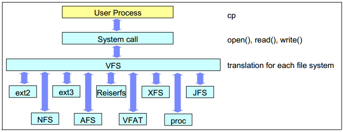

#文件概述

在使用linux的过程中，我们会发现一个有趣的现象，那就是linux可以挂载windows文件系统(NTFS)的硬盘，但是反过来却不行。原因其实就是linux有VFS(Virtual File System)。正因为有了它，"一切皆文件"这个思想的到了实现。

上图来说明VFS具有如此功效的原因：

我们可以发现，VFS对不同的文件系统做了一个抽象并且提供了接口。使得其他的文件系统可以都可以被VFS所使用。

上面我们提到过linux的一个设计思想——"一切皆文件"。下面我们就要对文件的操作开始进行介绍。在开始之前，要给大家提及"文件描述符"或者"文件句柄"的概念。在linux操作系统中，我们使用一个非负整数来代表要使用系统调用操作的目标文件。这个整数一般都很小。我们可以使用文件描述符来代表管道（pipe）、FIFO、socket、中端、设备、普通文件和进程。进程的文件描述符自成一套，有内核来定义。我们可以查看/proc/ID目录，来了解进程的信息。或者查看/proc目录下其他文件来查看系统信息。（扯得有点多了...）

在POSIX应用程序中，我们的标准输入输出也是符号常数。

1. STDIN_FILENO(标准输入，默认是键盘)
2. STDOUT_FILENO(标准输出，默认是屏幕)
3. STDERR_FILENO(标准错误输出，默认是屏幕)

