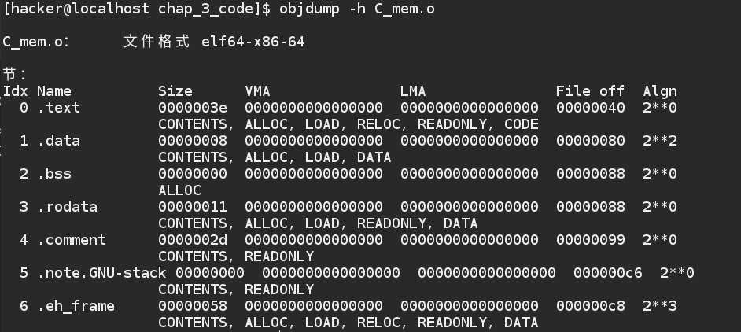
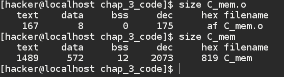

##C程序存储布局简例--变量去哪了？
&emsp;&emsp;
 在这里写一个小例子来体现C程序编译后（目标文件.O文件）的结构。
 
    #include<stdio.h>
    int global_one = 100;
    int global_two ;
    
    int print(int i){
    
        printf("The data is %d \n",i);
        
        return 0;
        
    }
    
    int  main(){
    
        static int local_one = 1;
        
        int local_two ;
        
        print(local_one);
        
        return 0;
    }
    
    
使用个gcc -c C_mem.c 生成C_mem.o 文件。然后使用段objdump 命令来查看这个目标文件的简要段分布，进一步感受下C程序的内存布局。如图所示：

    首先大体上介绍一下这个图（命令自行名读men page 吧）最上面是文件格式：我们这个是elf-x86-64格式的。
   
   下面就是各个段的具体情况了。依次是段名，大小，虚拟地址，逻辑地址，（  ）， （   ）
   
   每一行下边是这个段的属性（今天暂时不做介绍）。
   
   我们今天只关心程序的这些变量到底放到哪里了。
   
   首先我们看第一个text 段 不多说，就是我们的文本段，保存的是我们的代码大小是167字节。
   
   现在看 data 段，大小为4字节。就是变量 local_one 和 global_one,但是没有local_two 这是因为这个变量没有被实例化，对许现阶段目标文件而言就是一个符号，没有实际为它开辟空间存放。初始化的全局变量和静态局部变量都在这里。
   
   现在看 bss 段，我们知道未初始化的全局变量和静态局部变量一般放在这个段中，其实这些现在很多编译器都默认未初始化的默认为0.似乎也可以放到段data 中去但是这样会白白增大文件的大小。所以都放在BSS了，有人会问了这里为什么大小是0呢？如果在这里分配了大小岂不是和我们的初衷相违背了，这里只预留了位置而已gloabl_two，并没有内容,也不实际占用文件大小。
   
   另外像流local_twoz这个叫自动变量，只在运行时分配内存。所以这里并没有大小。
   
   现在说另一个问题 ，说好的C程序怎么变成.O 文件呢？
   
 其实这里是编译后的结果，并不是最终的可执行文件，最终的可执行文件大小是链接后的文件所以链接后的文件大小会变的很大，因为有很多库被链接了进来。我们可以用所size 命令间要看下，这个命令就是简要显示每个段的大小。
 
 
 由此看出，可执行文件的大小比目标文件大得多，就是因为可执行文件中还包含了很多静态的动态态的链接库。这里我们只关心我们自己的变量去哪了。