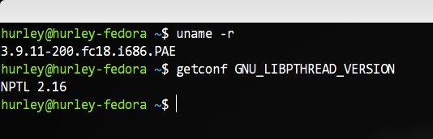
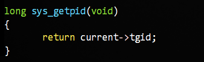
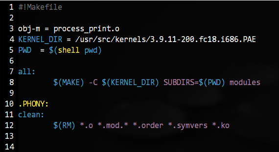
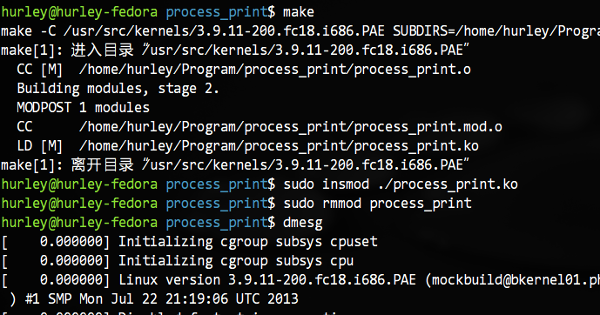
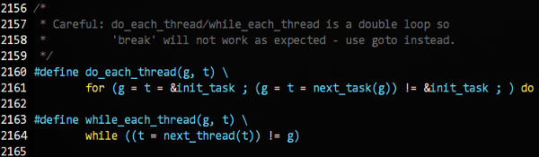
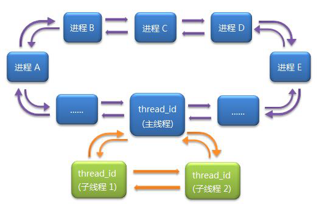
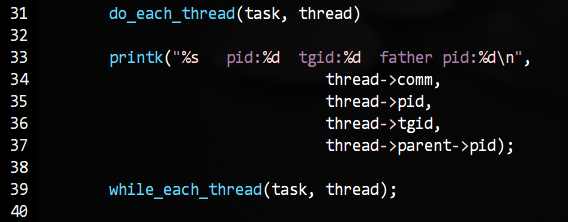
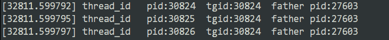
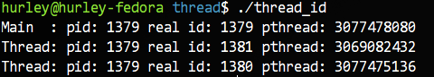

# Linux线程的前世今生

最近在重新翻阅《Unix环境高级编程》的时候，被书上的一段例程所困扰，那段代码是分别在主线程和子线程中使用 getpid() 函数打印进程标识符PID，书上告诉我们是不同的值，但是测试结果是主线程和子线程中打印出了相同的值。

在我的印象中《Linux内核设计与实现》这本书曾经谈到线程时如是说：从内核的角度来说，它并没有线程这个概念。Linux内核把所有的线程都当成进程来实现……在内核中，线程看起来就像是一个普通的进程（只是线程和其他一些进程共享某些资源，比如地址空间）。

《Unix环境高级编程》第二版著书时的测试内核是2.4.22，而《Linux内核设计与实现》这本书是针对2.6.34内核而言的(兼顾2.6.32)，而我的内核是3.9.11，难道是内核发展过程中线程的实现发生了较大的变化？百度一番之后发现资料乱七八糟不成系统，索性翻阅诸多文档和网页，整理如下。如有偏差，烦请大家指正。

在 Linux 创建的初期，内核一直就没有实现“线程”这个东西。后来因为实际的需求，便逐步产生了LinuxThreads 这个项目，其主要的贡献者是Xavier Leroy。LinuxThreads项目使用了 clone() 这个系统调用对线程进行了模拟，按照《Linux内核设计与实现》的说法，调用 clone() 函数参数是clone(CLONE\_VM | CLONE\_FS | CLONE\_FILES | CLONE_SIGHAND, 0)，即创建一个新的进程，同时让父子进程共享地址空间、文件系统资源、文件描述符、信号处理程序以及被阻断的信号等内容。也就是说，此时的所谓“线程”模型符合以上两本经典巨著的描述，即在内核看来，没有所谓的“线程”，我们所谓的“线程”其实在内核看来不过是和其他进程共享了一些资源的进程罢了。

通过以上的描述，我们可以得到以下结论：

> 1. 此时的内核确实不区分进程与线程，内核没有“线程”这个意识。
> 2. 在不同的“线程”内调用 getpid() 函数，打印的肯定是不同的值，因为它们在内核的进程链表中有不同的 task_struct 结构体来表示，有各自不同的进程标识符PID。

值得一提的是，内核不区分线程，那么在用户态的实现就必须予以区分和处理。所以 LinuxThreads  有一个非常出名的特性就是管理线程（manager thread）(这也是为什么实际创建的线程数比程序自己创建的多一个的原因)。管理线程必须满足以下要求：

> - 系统必须能够响应终止信号并杀死整个进程。
> - 以堆栈形式使用的内存回收必须在线程完成之后进行。因此，线程无法自行完成这个过程。终止线程必须进行等待，这样它们才不会进入僵尸状态。
> - 线程本地数据的回收需要对所有线程进行遍历；这必须由管理线程来进行。
> - ……

LinuxThreads 这个项目固然在一定程度上模拟出了“线程”，而且看起来实现也是如此的优雅。所以常常有人说，Linux 内核没有进程线程之分，其实就是这个意思。但这个方法也有问题，尤其是在信号处理、调度和进程间同步原语方面都存在问题。而且, 一组线程并不仅仅是引用同一组资源就够了, 它们还必须被视为一个整体。

对此，POSIX标准提出了如下要求：

> 1.  查看进程列表的时候，相关的一组 task_struct 应当被展现为列表中的一个节点；
> 2.  发送给这个”进程”的信号(对应 kill 系统调用)，将被对应的这一组 task_struct 所共享， 并且被其中的任意一个”线程”处理；
> 3. 发送给某个”线程”的信号(对应 pthread_kill )，将只被对应的一个 task_struct 接收，并且由它自己来处理；
> 4.  当”进程”被停止或继续时(对应 SIGSTOP/SIGCONT 信号)， 对应的这一组 task_struct 状态将改变；
> 5.  当”进程”收到一个致命信号(比如由于段错误收到 SIGSEGV 信号)，对应的这一组 task_struct 将全部退出；
> 6. ……

另外还有好多好多的问题，我们不一一列举，只引用 IBM 的相关论文作为补充：http://www.ibm.com/developerworks/cn/linux/kernel/l-thread/

有问题自然就有人在尝试解决问题，活跃的开源社区自然不会放任问题继续下去，后来就有了各种各样的尝试，其中既包括用户级线程库，也包括核心级和用户级配合改进的线程库。知名的有 RedHat 公司牵头研发的 NPTL（Native Posix Thread Library），另一个则是IBM投资开发的 NGPT（Next Generation Posix Threading），二者都是围绕完全兼容POSIX 1003.1c，同时在核内和核外做工作以而实现多对多线程模型。这两种模型都在一定程度上弥补了 LinuxThreads 的缺点，且都是重起炉灶全新设计的。

在开始下文之前，我们在终端上执行这个命令 getconf GNU\_LIBPTHREAD\_VERSION来检查自己机器所使用的线程库。在我的 fedora 18 上得到了如下的输出结果：



Fedora是RedHat系的，没理由不使用NPTL（开个玩笑）。按照维基百科的说法是，是NPTL赢得了今天附带绝大多数的Linux系统的支持，原文是：NPTL won out and is today shipped with the vast majority of Linux systems. 后来IBM貌似就慢慢放弃了，随着IBM的放弃，RedHat 的 Native POSIX Thread Library（NPTL）就成唯一的解决方案了。随着 NPTL 的崛起，Linux2.6 以及以上版本的内核中基本上很少能再看到 LinuxThreads 的身影了。

与 LinuxThreads 相比，NPTL 具有很多优点：

> NPTL 就没有使用管理线程。因为管理线程的一些需求，例如向作为进程一部分的所有线程发送终止信号，是并不需要的，因为内核本身就可以实现这些功能。内核还会处理每个线程堆栈所使用的内存的回收工作。它甚至还通过在清除父线程之前进行等待，从而实现对所有线程结束的管理，这样可以避免僵尸进程的问题。

还有好多的优势和相关的比较，详见这里：

http://www.ibm.com/developerworks/cn/linux/l-threading.html

现在，我们关心的是在 NPTL 对内核作出改动之后，现在的线程模型大概是怎么一回事，内核是否依旧不区分进程与线程呢？getpid() 函数返回的为何是一样的数值？别急，我们继续往下看。

传言在2002年8、9月份，一直不肯松劲的 Linus Torvalds 先生终于被说服了，Ingo Molnar 把一些重要特性加入到2.5开发版官方内核中。这些特性大体包括：新的clone系统调用，TLS系统调用，posix 线程间信号，exit_group (exit的一个变体 )等内容。此时有了OS的支持，Ingo Molnar 先生同 Ulrich Drepper（GLIBC的LinuxThreads库的维护者，NPTL 的设计者与维护者，现工作于 RedHat 公司）和其他一些 Hackers 开始 NPTL 的完善工作。

所以说 NPTL 并不是完全在用户态实现的线程库，事实上内核也进行了一定程度的支持。既然getpid()函数返回了不一样的值，那我们就从这个函数的实现开始研究。因为现代的Linux内核引入了 “Container” 的概念。Container 类似于虚拟机的概念，每个 Container 都会有自己的 namespace。说了这么多，其实意思就是内核中两个 PID namespace 中可以有 PID 相同的进程；一个轻量级进程可以同时出现在两个 namespace 中，这就意味着该轻量级进程具有两个或以上的 PID。而  task_struct(进程控制块PCB) 结构体中还有 group->leader 域来标记该轻量级进程所在组的领头进程。我们今天就先看早前的实现，避免引入太多影响我们偏离主题。现代的实现方法有兴趣的的童鞋访问下面链接研究吧。

http://blog.csdn.net/fengtaocat/article/details/7001527

早些的实现是这样：



对，你没看错，返回的是 TGID 这个成员，而 current 是一个宏，代表当前的程序。这个 TGID 又是何许人也？这个东西的全称是”Thread Group ID”的意思，即线程组ID的意思，其值等于进程的 PID。所以在一个进程的各个线程中调用getpid()函数的话得到的值是一样的。NPTL 通过这样的一个途径实现了之前的线程库没有解决的线程组的问题。

实质上到今天，Linux 内核依旧没有区分进程与线程。这和 Microsoft Windows、或是Sun Solaris等操作系统的实现差异非常大。那么，此时 Linux 内核里那个 task_struct 组成的双向循环链表此时又是什么情景呢？

揣测了一会没有答案，我们还是写个内核模块来看访问下进程表看看。

代码如下：

```c
#include <linux/kernel.h>
#include <linux/module.h>
#include <linux/proc_fs.h>
#include <linux/init.h>
#include <linux/sched.h>

static int __init print_init(void)
{
        struct task_struct *task;

        printk("process info:n");
        for_each_process(task)
                printk("%s   pid:%d  tgid:%d  father pid:%dn",
                                thread->comm,
                                thread->pid,
                                thread->tgid,
                                thread->parent->pid);
        return 0;
}

static void __exit print_exit(void)
{
        printk("Goodbye, process_print!n");
}

module_init(print_init);
module_exit(print_exit);
MODULE_AUTHOR("hurley");
MODULE_DESCRIPTION("Print Process Info.");
MODULE_LICENSE("GPL");
```

Makefile如下：



但是光有这个程序是不够的，我们再写一个用户态的创建线程的程序，它将创建两个线程，而线程会一直睡眠不退出。代码很简单，就不贴了。我们编译这个程序 thread\_id，执行它，然后我们编译内核模块，载入，然后卸载。最后执行dmesg命令查看内核输出：



我们在众多的输出最后找到了我们的程序，可是，只有一项结果，没有多个来自 task\_struct 的输出。这…….难道？内核的管理方式发生了改变？等等，我们在内核头文件里我们使用的 for\_each\_process宏下面发现了这样一组宏：



通过继续对宏的展开分析，我们发现原来同一个线程组的线程只有主线程在那个大循环里，而每一个进程的线程在自己的一个小循环里(这里的循环的实现是双向循环链表)。

示意图如下：



我们将遍历部分的代码如下修改：



然后重新执行上面的测试，果然，我们得到了来自三个task_struct结构体的输出：



我们知道，在线程里调用 getpid() 函数，获取的是TGID，那么如果我们需要获得线程真实的 PID 怎么办呢？有一个系统调用是 sys_gettid() 可以帮助我们，不过 GLIBC 并没有提供包装函数，所以我们干脆直接使用 syscall() 函数加系统调用号 224 来实现（另外支持在日志里打线程的 tid，proc 里就能查到相关信息，也便于后期追查）。

结果如下：



我们简单介绍下规则。如果这个 task 是一个”主线程”, 则它的 TGID 等于 PID, 否则 TGID 等于进程的PID(即主线程的PID)。在 clone 系统调用中, 传递 CLONE_THREAD 参数就可以把新进程的 TGID 设置为父进程的 TGID (否则新进程的 TGID 会设为其自身的 PID)。

时间不早了，就此打住。当然了，NPTL 其他的改变和设计还有很多，我就不一一列举了，姑且留下其作者自己写的一篇文章供有兴趣继续深究的同学研究吧。

地址在此：http://www.akkadia.org/drepper/nptl-design.pdf
