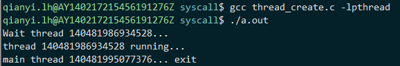

# 线程的创建与结束

首先，我对坚持着看到这里的同学表示感谢。前面的描述是有点高（kan）大（bu）上（dong），不过到了具体的线程函数的使用这里，就没有那么难了。不信吗？我们先来看一个例子：

```c
#include <stdio.h>
#include <stdlib.h>
#include <pthread.h>

void *thread_func(void *args)
{
    sleep(1);
    printf("thread %ld running...\n", pthread_self());

    return NULL;
}

int main(int argc, char *argv[])
{
    pthread_t tid;

    int rc = pthread_create(&tid, NULL, thread_func, NULL);
    if (rc < 0) {
        perror("create thread error: ");
        return -1;
    }
    printf("Wait thread %ld...\n", (long)tid);
    
    pthread_join(tid, NULL);

    printf("main thread %ld... exit\n", (long)pthread_self());

    return 0;
}
```

编译，注意gcc编译的命令行要加-lpthread，因为线程库并没有被默认链接。运行的结果如下：



这个代码并没有做任何实质上的工作，只是演示了三个线程相关的函数的用法：创建线程的pthread_create函数、等待某线程结束的函数pthread_join和获取线程自身ID的函数pthread_self.

先从简单的介绍，pthread_self函数返回线程的ID值，是pthread_t类型。可能你已经注意到了示例代码中打印这个类型时通过long类型强转后用%ld描述符输出。这是一个工程代码的习惯做法，如果标准没有指明pthread_t到底是几字节的整形的typedef的时候（标准甚至没有说明白pthread_t是否满足基本变量的相等比较，而是提供了一个函数pthread_equal来比较两个pthread_t是否相等），转换成long并输出一般是比较好的做法（64bit操作系统）。在之前的进程那一章节有关于进程pid的获取函数getpid的介绍。进程的pid是操作系统内核分配管理的，但是pthread库这里的pthread_t所表示的ID值对于操作系统内核来说并不知情，所以在一些问题的追查上会遇到一些麻烦。暂时我们知道这些就可以，等学习深入之后，本书的升级版会讲述工程上的做法。

最关键的来了，pthread_create用于创建新的线程来执行代码。因为它的返回值来表示是否发生了错误，所以我们需要传入pthread_t类型变量的指针来“返回”新创建的线程ID。第二个参数是线程属性，因为暂时不需要特殊的选项，所以传入NULL就好。第三第四个参数分别是要执行的函数的指针和传入这个函数的参数。线程函数的原型被限定为传入一个void \* 的指针并返回一个void \* 的指针。这是因为这个函数的设计者并不知道用户会传入和返回什么类型，那就由用户自定义参数或返回值的结构体（或者用C语言普通变量）并传入指针好了。

如果这个函数未返回错误，那么线程就创建并开始执行了。不过类似进程的创建那样，我们不能对新任务和老任务的先后执行关系做任何的假设，这一切要依赖于操作系统的调度。

接着是pthread_join这个函数。main函数中调用了这个函数来等待我们之前创建的子线程结束，在这期间main函数并没有做什么，之后也就简单的打印了一些信息就结束了。

为什么要等待？如果不呢？注释掉这一行再编译执行。居然没有打印出线程函数的语句，但是pthread_create也没有返回错误啊。

是的，线程是创建成功了。原因是这样，一个进程被创建出来后是有一个默认的执行流的，也就是所谓的“主线程”，它在执行main函数的代码。用pthread_create创建出来的线程都属于“子线程”（在子线程的函数里创建出来的线程也是子线程，和其它子线程都是兄弟关系）。当一个进程的主线程结束的时候，操作系统会强制结束掉该进程的所有子线程，连留下遗言的机会也不给。子线程在处于sleep函数未返回的时候，就被悄悄的kill掉了。所以在程序退出的时候，一定要记得逐一join创建的所有的线程，否则有些任务没有正常执行完就被强制kill掉了，而且不会有任何提示。pthread_join函数会等待给定的ID的线程结束后才会返回，如果给定ID的线程在此之前早已结束返回（线程函数执行完返回）了，那pthread_join函数立即就会返回。不难理解吧？

那如果说某个线程函数一直在运行，由于某种特殊情况要立即结束掉这个线程怎么办？有办法，有pthread_cancel函数来做这件事情，传入要结束的线程ID即可。**但是请慎用这个函数！**为什么？因为子线程此刻在执行什么操作你并不能完全肯定，比如子线程可能刚刚打开了文件，可能正在写文件，可能正malloc了一大块内存还没有释放……贸然的结束一个线程，会导致某些资源没有被合理的释放掉。如果你的程序需要用这种方式来强制结束一个线程，八成是实现逻辑上出了问题。一定要通过合理的设计来避免这种操作。贸然结束线程为什么会出现资源相关的问题？操作系统不会回收吗？之前进程那里明明说进程结束后，资源会被操作系统回收的啊。别着急，这章就简单介绍到这里，下一章节专门来聊这个问题。